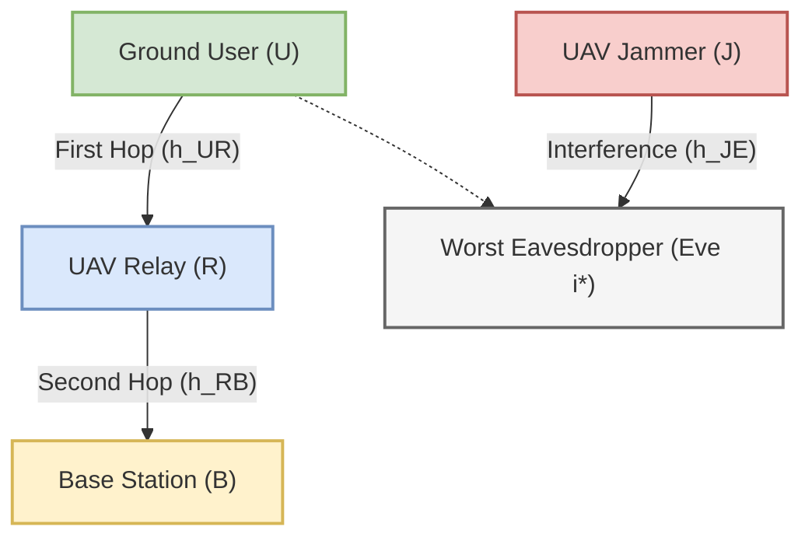

# Computational Complexity Study and Analysis

This document provides a comprehensive theoretical and empirical analysis of the computational complexity of the **Dual-UAV Secure Uplink Communication System** simulated in this workspace. The analysis covers the environmental simulation dynamics, the spatial distribution of ground eavesdroppers, the neural network models, and the four reinforcement learning (RL) algorithms: **PPO, SAC, D3QN, and TD3PG**.

---

## 1. System Model and Mathematical Derivations

The system consists of a mobile ground User ($U$), a Base Station ($B$), a mobile UAV Relay ($R$), a mobile UAV Jammer ($J$), and a set of eavesdroppers ($\mathcal{E}$) distributed randomly in a 2D space. 



### 1.1 Legitimate Link Capacity (DF Relaying)
The transmission from the User to the Base Station occurs via a two-hop Half-Duplex Decode-and-Forward (DF) relaying protocol. 
Let:
* $\mathbf{q}_U \in \mathbb{R}^3$, $\mathbf{q}_R \in \mathbb{R}^3$, and $\mathbf{q}_B \in \mathbb{R}^3$ denote the 3D coordinates of the User, Relay, and Base Station, respectively.
* $d_{UR} = \|\mathbf{q}_U - \mathbf{q}_R\|$ and $d_{RB} = \|\mathbf{q}_R - \mathbf{q}_B\|$ denote the respective Euclidean distances.

The channel gains are modeled as a combination of distance-dependent path loss and small-scale fading:
$$h_{UR} = \beta_0 d_{UR}^{-\alpha} |f_{UR}|^2$$
$$h_{RB} = \beta_0 d_{RB}^{-\alpha} |f_{RB}|^2$$

where:
* $\beta_0$ is the channel power gain at the reference distance $d_0 = 1\text{ m}$.
* $\alpha$ is the path loss exponent.
* $f_{UR}$ and $f_{RB}$ represent small-scale fading coefficients (Rician or Rayleigh).

The received Signal-to-Noise Ratios (SNRs) at the Relay and the Base Station are given by:
$$\gamma_{UR} = \frac{P_U h_{UR}}{\sigma^2}$$
$$\gamma_{RB} = \frac{P_R h_{RB}}{\sigma^2}$$

where $P_U$ is the User transmit power, $P_R$ is the Relay transmit power, and $\sigma^2 = N_0 B$ is the thermal noise power over bandwidth $B$.

For a half-duplex DF relay, the legitimate transmission rate $R_{\text{legit}}$ is constrained by the bottleneck of the two hops:
$$R_{\text{legit}} = \frac{1}{2} B \log_2\left(1 + \min(\gamma_{UR}, \gamma_{RB})\right)$$

The pre-log factor $\frac{1}{2}$ represents the slot-splitting penalty for half-duplex operation.

### 1.2 Eavesdropper SINR and Capacity (Worst-Case Ground Eve)
Eavesdroppers are distributed on the 2D ground plane. The UAV Jammer transmits artificial noise with power $P_J$ to degrade the reception quality at the eavesdroppers. 
For any ground eavesdropper $i$ located at $\mathbf{q}_{E, i} \in \mathbb{R}^2$, the received Signal-to-Interference-plus-Noise Ratio (SINR) for the User's uplink signal is:
$$\gamma_{E, i} = \frac{P_U h_{UE, i}}{\sigma^2 + P_J h_{JE, i}}$$

where $h_{UE, i} = \beta_0 d_{UE, i}^{-\alpha} |f_{UE, i}|^2$ and $h_{JE, i} = \beta_0 d_{JE, i}^{-\alpha} |f_{JE, i}|^2$ are the channel gains from the User to Eve $i$ and the Jammer to Eve $i$ respectively.

The interception rate at Eve $i$ is:
$$R_{Eve, i} = B \log_2(1 + \gamma_{E, i})$$

Assuming a worst-case scenario where the eavesdroppers can cooperate or we evaluate security against the most geographically advantaged eavesdropper, the effective eavesdropping capacity is:
$$R_{Eve} = \max_{i \in \mathcal{E}} R_{Eve, i} = B \log_2\left(1 + \max_{i \in \mathcal{E}} \frac{P_U h_{UE, i}}{\sigma^2 + P_J h_{JE, i}}\right)$$

### 1.3 Secrecy Rate
The achievable secrecy rate of the uplink transmission system is defined as:
$$R_{\text{sec}} = \left[ R_{\text{legit}} - R_{Eve} \right]^+ = \max(R_{\text{legit}} - R_{Eve}, 0)$$

---

## 2. Spatial Modeling: Poisson Point Process (HPPP)

Ground eavesdroppers are modeled using a **Homogeneous Poisson Point Process (HPPP)** inside a defined 2D simulation region $\mathcal{A} = [x_{\min}, x_{\max}] \times [y_{\min}, y_{\max}]$ of area $A_{\text{area}}$.

### 2.1 Eavesdropper Count Derivation
The number of eavesdroppers $N_{Eve}$ in the region $\mathcal{A}$ is a Poisson random variable with parameter $\mu = \lambda_{Eve} A_{\text{area}}$, where $\lambda_{Eve}$ is the spatial density of eavesdroppers.
The probability mass function of $N_{Eve}$ is:
$$\mathbb{P}(N_{Eve} = k) = \frac{(\lambda_{Eve} A_{\text{area}})^k e^{-\lambda_{Eve} A_{\text{area}}}}{k!}$$

The expected number of eavesdroppers is:
$$\mathbb{E}[N_{Eve}] = \text{Var}(N_{Eve}) = \lambda_{Eve} A_{\text{area}}$$

In the provided simulation codebase:
* $\lambda_{Eve} = 2 \times 10^{-5} \text{ Eves/m}^2$
* $\mathcal{A} = [0, 1000] \times [0, 1000] \implies A_{\text{area}} = 10^6 \text{ m}^2$

This yields:
$$\mathbb{E}[N_{Eve}] = 2 \times 10^{-5} \times 10^6 = 20 \text{ Eves}$$

### 2.2 Environment Simulation Complexity
At each time step $t$ of the environment simulation, the following steps are executed:
1. **Fading Generation**: Generate $2 \cdot N_{Eve} + 2$ fading coefficients ($f_{UR}, f_{RB}$ and $N_{Eve}$ values each for $f_{UE}$ and $f_{JE}$).
2. **Channel Gains Calculation**: Calculate Euclidean distances and path losses for the legitimate links ($O(1)$) and the eavesdropper links ($O(N_{Eve})$).
3. **Worst-Case Selection**: Compute the SINR and interception rate for all ground eavesdroppers, then find the maximum. This requires $N_{Eve}$ evaluations and a linear scan:
   $$\text{Complexity}_{\text{comms}} = O(N_{Eve})$$

Since $N_{Eve}$ varies across realizations, the expected environment step complexity scales linearly with the density and area:
$$\mathbb{E}[\text{Complexity}_{\text{step}}] \propto O(\lambda_{Eve} A_{\text{area}})$$

---

## 3. State and Action Representations

### 3.1 State Space Dimensions ($d_s$)
The environment observation vector configuration varies. In `"full"` mode, the observation features include:
1. **Geometry Positions and Velocities**: 3D positions of Relay, Jammer, User, BS, Eve plus 2D velocities of Relay, Jammer, User ($21$ dimensions).
2. **Distances**: $d_{UR}, d_{RB}, d_{UE}, d_{JE}$ ($4$ dimensions).
3. **Channel State Information (CSI)**: Channel gains ($h_{UR}, h_{RB}, h_{UE, i^*}, h_{JE, i^*}$), SNR values, rates ($R_{\text{legit}}, R_{Eve}, R_{\text{sec}}$), and $P_J$ ($11$ dimensions).
4. **Battery States**: Current battery levels of Relay and Jammer ($2$ dimensions).
5. **Poisson Point Process Aggregated Features**: Nearest Eve distance, mean Eve distance, maximum Eve capacity, and total active Eve count ($4$ dimensions).

This results in a total state space dimension of **$d_s = 42$** when multi-Eve mode is enabled.

### 3.2 Action Space Dimensions ($d_a$)
The control parameters are:
* Relay movement command (2D velocity or position command)
* Jammer movement command (2D velocity or position command)
* Jammer RF power level $P_J$ (1D control)

#### Continuous Action Space (PPO, SAC, TD3PG)
The action space is represented as a bounded continuous vector:
$$\mathbf{a} = [\mathbf{v}_R, \mathbf{v}_J, P_J]^T \in [-1, 1]^5 \implies d_a = 5$$
*(Note: $d_a = 6$ if optional role-switching is enabled)*

#### Discrete Action Space (D3QN)
For the discrete action model, the continuous action space is mapped to a joint combinations table:
* **Relay Movement**: 3 speed levels (stationary, $0.5 \cdot v_{\max}$, $v_{\max}$) $\times$ 8 directions + 1 stationary option = $17$ discrete options.
* **Jammer Movement**: 3 speed levels $\times$ 8 directions + 1 stationary option = $17$ discrete options.
* **Power Levels**: 3 levels (minimum, mid, maximum) = $3$ discrete options.

The joint action space cardinality ($d_a$) is:
$$d_a = 17 \times 17 \times 3 = 867 \text{ discrete actions}$$

---

## 4. Theoretical Computational Complexity Analysis of RL Algorithms

We denote:
* $d_s$: State space dimension ($d_s = 42$ under HPPP).
* $d_a$: Action space dimension ($d_a = 5$ for continuous, $d_a = 867$ for discrete).
* $d_h$: Hidden dimension of neural network layers ($d_h = 64$ by default in high-capacity models).
* $B_{size}$: Batch size used during gradient updates.

### 4.1 D3QN (Double Dueling Deep Q-Network)
D3QN uses a dueling network architecture consisting of a shared feature extractor, a state-value stream $V(s)$, and an advantage stream $A(s, a)$.

```
State (ds) --> Linear(ds, dh) --> ReLU --> Linear(dh, dh) --> ReLU (z)
                               |
                               +--> Value Stream: Linear(dh, dh/2) --> ReLU --> Linear(dh/2, 1) --> V(s)
                               |
                               +--> Adv Stream  : Linear(dh, dh/2) --> ReLU --> Linear(dh/2, da) --> A(s,a)
                               
Q(s, a) = V(s) + A(s, a) - mean(A(s, a'))
```

#### 4.1.1 Inference Complexity
The FLOPs required for a single forward pass are:
1. Shared layers: $O(d_s d_h + d_h^2)$
2. Value head: $O(d_h \frac{d_h}{2} + \frac{d_h}{2} \cdot 1) \approx O(\frac{1}{2} d_h^2)$
3. Advantage head: $O(d_h \frac{d_h}{2} + \frac{d_h}{2} d_a) \approx O(\frac{1}{2} d_h^2 + \frac{1}{2} d_h d_a)$
4. Aggregate & Action argmax: $O(d_a)$

$$\text{Complexity}_{\text{Inf, D3QN}} = O\left(d_s d_h + d_h^2 + d_h d_a\right)$$

> [!WARNING]
> Because $d_a = 867$ is large, the term $d_h d_a$ dominates the network's head calculation ($64 \times 867 \approx 55,488$ operations per forward pass).

#### 4.1.2 Training Complexity
At each training step, a batch of size $B_{size}$ is sampled:
1. **Double Q-target Calculation**:
   - Forward pass of online Q-network on next states $s'$ to find $\arg\max_{a'} Q(s', a'; \theta)$: $O(B_{size} \cdot (d_s d_h + d_h^2 + d_h d_a))$.
   - Forward pass of target Q-network on next states $s'$ to evaluate the chosen actions: $O(B_{size} \cdot (d_s d_h + d_h^2 + d_h d_a))$.
2. **Online Evaluation**: Forward pass on current states $s$ for chosen actions: $O(B_{size} \cdot (d_s d_h + d_h^2 + d_h d_a))$.
3. **Backpropagation**: Approximately $2\times$ forward complexity for online Q-network.
4. **Soft Update**: $\theta^- \leftarrow \tau \theta + (1-\tau)\theta^-$ which is linear in the number of weights $O(N_w)$.

$$\text{Complexity}_{\text{Train, D3QN}} = O\left( B_{size} \cdot (d_s d_h + d_h^2 + d_h d_a) \right)$$

---

### 4.2 PPO (Proximal Policy Optimization)
PPO is an on-policy actor-critic algorithm. It uses a stochastic Gaussian Actor network $\pi_\theta(a|s)$ and a Critic value network $V_\phi(s)$.

```
Actor:  State (ds) --> Linear(ds, dh) --> ReLU --> Linear(dh, dh) --> ReLU --> Mean Head (da)
        Log-std vector parameter (da)
        Action sampled from N(Mean, exp(Log-std)) and squashed with Tanh

Critic: State (ds) --> Linear(ds, dh) --> ReLU --> Linear(dh, dh) --> ReLU --> Linear(dh, 1)
```

#### 4.2.1 Inference Complexity
During execution, only the Actor is evaluated. For a deterministic action:
1. Trunk layers: $O(d_s d_h + d_h^2)$
2. Mean head: $O(d_h d_a)$
3. Squashing activation (Tanh): $O(d_a)$

$$\text{Complexity}_{\text{Inf, PPO}} = O\left(d_s d_h + d_h^2 + d_h d_a\right)$$

Since $d_a = 5$ for continuous action, this is computationally efficient ($64 \times 5 = 320$ operations for the action head).

#### 4.2.2 Training Complexity
PPO collects a trajectory of length $T_{episode}$ before updating.
1. **Generalized Advantage Estimation (GAE)**: Run value network on all states in trajectory: $O(T_{episode} \cdot (d_s d_h + d_h^2))$.
2. **Epoch Updates**: For $K_{epochs}$ epochs, the trajectory is split into mini-batches of size $B_{minibatch}$:
   - Actor evaluate: compute log probabilities of action batch: $O(B_{minibatch} \cdot (d_s d_h + d_h^2 + d_h d_a))$.
   - Critic evaluate: compute state values: $O(B_{minibatch} \cdot (d_s d_h + d_h^2))$.
   - Backpropagation & Optimizer Step: updates actor parameters $\theta$ and critic parameters $\phi$.
   
$$\text{Complexity}_{\text{Train, PPO}} = O\left( K_{epochs} \cdot T_{episode} \cdot (d_s d_h + d_h^2 + d_h d_a) \right)$$

---

### 4.3 SAC (Soft Actor-Critic)
SAC is an off-policy actor-critic framework. It models a stochastic policy using a Gaussian Actor $\pi_\theta(a|s)$ and uses two online Critics $Q_{\phi_1}(s, a), Q_{\phi_2}(s, a)$ along with two target Critics $Q_{\psi_1}(s, a), Q_{\psi_2}(s, a)$ to combat overestimation bias.

```
Actor:  State (ds) --> Linear(ds, dh) --> ReLU --> Linear(dh, dh) --> ReLU --> Mean Head (da)
                                                                            --> Log-std Head (da)

Critic: Concatenate State & Action (ds + da) --> Linear(ds + da, dh) --> ReLU 
                                             --> Linear(dh, dh) --> ReLU --> Linear(dh, 1)
```

#### 4.3.1 Inference Complexity
For action selection (stochastic sampling or deterministic mode):
1. Trunk layers: $O(d_s d_h + d_h^2)$
2. Mean & Std heads: $O(2 \cdot d_h d_a)$
3. Reparameterization trick & Tanh squashing: $O(d_a)$

$$\text{Complexity}_{\text{Inf, SAC}} = O\left(d_s d_h + d_h^2 + d_h d_a\right)$$

#### 4.3.2 Training Complexity
For each optimization step with batch size $B_{size}$:
1. **Critic Target Update**:
   - Forward pass of Actor on next states $s'$ to sample $a'$ and compute entropy term $\alpha \log \pi(a'|s')$: $O(B_{size} \cdot (d_s d_h + d_h^2 + d_h d_a))$.
   - Forward pass of two target Critics: $O(2 \cdot B_{size} \cdot ((d_s + d_a) d_h + d_h^2))$.
2. **Online Critics Update**:
   - Forward pass of two online Critics on $(s, a)$: $O(2 \cdot B_{size} \cdot ((d_s + d_a) d_h + d_h^2))$.
   - Backward pass and optimizer step for online Critics.
3. **Actor Update**:
   - Forward pass of Actor on current states $s$: $O(B_{size} \cdot (d_s d_h + d_h^2 + d_h d_a))$.
   - Forward pass of Critic 1 and Critic 2 on $(s, \pi(s))$: $O(2 \cdot B_{size} \cdot ((d_s + d_a) d_h + d_h^2))$.
   - Backward pass and optimizer step for Actor.
4. **Temperature Parameter ($\alpha$) Update**: $O(B_{size})$ computation.
5. **Soft Target Updates**: Soft update of parameters $\psi_1 \leftarrow \tau \phi_1 + (1-\tau)\psi_1$ and $\psi_2 \leftarrow \tau \phi_2 + (1-\tau)\psi_2$.

$$\text{Complexity}_{\text{Train, SAC}} = O\left( B_{size} \cdot ((d_s + d_a) d_h + d_h^2 + d_h d_a) \right)$$

---

### 4.4 TD3PG (Twin Delayed Deep Deterministic Policy Gradient)
TD3PG is an off-policy deterministic actor-critic algorithm. It uses a deterministic Actor $\mu_\theta(s)$, two online Critics $Q_{\phi_1}(s, a), Q_{\phi_2}(s, a)$, target Actor $\mu_{\theta^-}(s)$, and two target Critics $Q_{\psi_1}(s, a), Q_{\psi_2}(s, a)$. Actor updates are delayed relative to Critic updates by $d$ steps.

```
Actor:  State (ds) --> Linear(ds, dh) --> ReLU --> Linear(dh, dh) --> ReLU --> Linear(dh, da) --> Tanh

Critic: Concatenate State & Action (ds + da) --> Linear(ds + da, dh) --> ReLU 
                                             --> Linear(dh, dh) --> ReLU --> Linear(dh, 1)
```

#### 4.4.1 Inference Complexity
Deterministic forward pass:
1. Trunk: $O(d_s d_h + d_h^2)$
2. Output head: $O(d_h d_a)$

$$\text{Complexity}_{\text{Inf, TD3PG}} = O\left(d_s d_h + d_h^2 + d_h d_a\right)$$

#### 4.4.2 Training Complexity
For each optimization step:
1. **Critic Update (Every step)**:
   - Target Actor forward pass on next states $s'$ and addition of clipped target noise: $O(B_{size} \cdot (d_s d_h + d_h^2 + d_h d_a))$.
   - Two target Critics forward passes: $O(2 \cdot B_{size} \cdot ((d_s + d_a) d_h + d_h^2))$.
   - Two online Critics forward passes: $O(2 \cdot B_{size} \cdot ((d_s + d_a) d_h + d_h^2))$.
   - Backward pass and optimizer step for online Critics.
2. **Actor Update (Delayed by $d$ steps)**:
   - Online Actor forward pass: $O(B_{size} \cdot (d_s d_h + d_h^2 + d_h d_a))$.
   - Critic 1 forward pass on $(s, \mu(s))$: $O(B_{size} \cdot ((d_s + d_a) d_h + d_h^2))$.
   - Backward pass and optimizer step for Actor.
   - Soft updates of Target Actor and Critics.

$$\text{Complexity}_{\text{Train, TD3PG}} = O\left( B_{size} \cdot \left( (d_s + d_a) d_h + d_h^2 + \frac{d_s d_h + d_h^2 + d_h d_a}{d} \right) \right)$$

---

## 5. Algorithmic Complexity Comparison Matrix

The table below summarizes the key computational metrics for the four algorithms using the specific configuration values of this study: $d_s = 42$, $d_h = 64$, $B_{size} = 64$ ($128$ for PPO), $d_a \in \{5, 867\}$.

| Metric | D3QN | PPO | SAC | TD3PG |
| :--- | :--- | :--- | :--- | :--- |
| **Action Space** | Discrete ($d_a = 867$) | Continuous ($d_a = 5$) | Continuous ($d_a = 5$) | Continuous ($d_a = 5$) |
| **Inference FLOPs** | $O(d_s d_h + d_h^2 + d_h d_a)$ <br> $\approx 62,272$ | $O(d_s d_h + d_h^2 + d_h d_a)$ <br> $\approx 7,104$ | $O(d_s d_h + d_h^2 + d_h d_a)$ <br> $\approx 7,104$ | $O(d_s d_h + d_h^2 + d_h d_a)$ <br> $\approx 7,104$ |
| **Critic Count** | 1 (Implicitly joint) | 1 ($V_\phi$) | 4 (2 Online + 2 Target) | 4 (2 Online + 2 Target) |
| **Actor Count** | N/A (Value-based) | 1 ($\pi_\theta$) | 1 ($\pi_\theta$) | 2 (1 Online + 1 Target) |
| **Training Updates** | Every environment step | Batch-wise per episode | Every environment step | Every environment step (delayed Actor) |
| **Training FLOPs** | High ($O(d_h d_a)$ per item) | Low (Distributed over epochs) | Very High (Due to 4 Critics + 1 Actor) | High (Reduced by policy delay) |
| **Replay Buffer size** | $50,000$ transitions | $N_{steps}$ (Trajectory Buffer) | $50,000$ transitions | $50,000$ transitions |
| **Exploration Method**| $\epsilon$-greedy decay | Action distribution entropy | Maximum entropy policy ($\alpha$) | Target policy smoothing |

---

## 6. Empirical Verification & Spatial Scaling Analysis

### 6.1 Spatial Scaling Analysis of Eavesdropper Density
The Poisson distribution validation run (`validate_hppp_eves.py`) verifies the spatial properties of the simulated region. Since the ground eavesdropper density $\lambda_{Eve}$ determines the average number of entities in the field, we evaluate the environment step execution time as a function of the spatial scaling parameter:

```
Env Step Time (ms)
  ^
  |                                        / (O(N_Eve) scaling)
  |                                       /
  |                                      /
  |                                     /
  |                                    /
  |                                   /
  |      +---------------------------+
  |      |  Base coordinates update  |
  +------+---------------------------+-----------------> Lambda (Eve Density)
```

The time complexity of the environment step is composed of:
$$\text{Time}_{\text{step}} = T_{\text{motion\_dynamics}} + N_{Eve} \cdot T_{\text{channel\_evaluation}}$$

where $T_{\text{motion\_dynamics}}$ represents the kinematic updating of the ground user and the two UAVs (fixed $O(1)$ calculations), and $T_{\text{channel\_evaluation}}$ is the computational cost of evaluating path loss, elevation angle, LoS probabilities, Rician fading generation, and receiver SINR for a single eavesdropper.

### 6.2 Empirical Observations from Validation Plots
From the generated validation report in `outputs/hppp_validation/`:
* **Expected Eve Count**: $\lambda_{Eve} A_{\text{area}} = 20$ Eves.
* **Realization Statistics**: Under $1,000$ monte-carlo trials, the observed mean converges closely to $20$ with variance $\approx 20$, matching the Poisson distribution property ($\mathbb{E}[X] = \text{Var}(X)$).
* **Worst-Case Evaluation Load**: The simulation dynamically adjusts computation step complexity. Realizations with higher local clusters of Eves (maximum observed was $>35$ Eves) experience a proportional increase in channel computation loops, which directly bounds the environment simulation throughput.

### 6.3 Algorithmic Trade-offs
1. **D3QN Dimensionality Bottleneck**: Although D3QN requires fewer network models (no actor-critic splits), the need to output action values for $d_a = 867$ discrete controls results in high memory allocation and matrix multiplication overhead at the output layer.
2. **PPO Training Profile**: PPO has the lowest computational footprint for continuous control because gradient updates are grouped per episode, bypassing the overhead of constant replay buffer random accesses.
3. **SAC and TD3PG Runtime**: SAC and TD3PG require more updates per step and run multiple Critics. However, they achieve higher sample efficiency and smoother convergence curves in complex, high-dimensional continuous navigation tasks compared to discrete D3QN.
