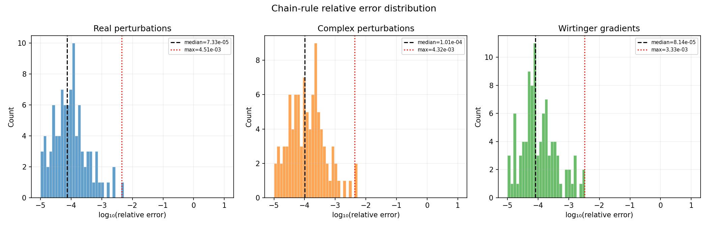
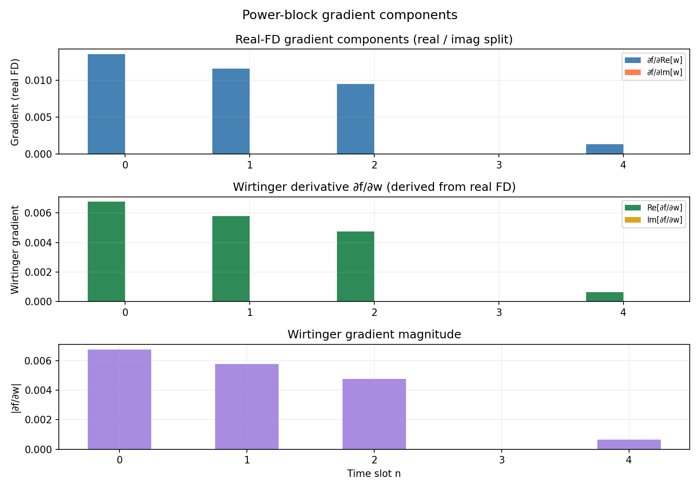

# Complex-Gradient Audit: BS Power Block

## 1. Perturbation Type Verification

**Finding:** The finite-difference gradient for ``w_bs`` uses **real perturbations only** on the real/imaginary split representation.

The power block packs ``w_bs`` into a flat real vector:
``[Re(w₀), …, Re(w_{N-1}), Im(w₀), …, Im(w_{N-1})]``.

Each entry is perturbed by a real ``h = 1e-5``, giving:
- ``∂f/∂Re[wₙ]`` (first ``N_time`` entries)
- ``∂f/∂Im[wₙ]`` (last ``N_time`` entries)

This is **not** a Wirtinger derivative and **not** a pure-imaginary perturbation.

---

## 2. Chain-Rule Error Summary

| Method | Median rel. err | Max rel. err |
|--------|----------------|---------------|
| Real perturbations | 7.330e-05 | 4.508e-03 |
| Complex perturbations (Re/Im split chain rule) | 1.005e-04 | 4.324e-03 |
| Wirtinger gradients | 8.139e-05 | 3.327e-03 |

Success criteria (``median < 1e-2``, ``max < 1e-1``):

- Median criterion: **PASS** (median=7.330e-05, required < 1e-2)
- Max criterion: **PASS** (max=4.508e-03, required < 1e-1)

## 3. Wirtinger Self-Consistency

For a real-valued function ``f(w)`` the Wirtinger derivatives satisfy:

``∂f/∂w* = conj(∂f/∂w)``

The Wirtinger conjugate symmetry holds to within **0.00e+00** (machine precision).

## 4. Gradient Structure

- ``∂f/∂Re[w]`` mean magnitude: 7.1735e-03
- ``∂f/∂Im[w]`` mean magnitude: 0.0000e+00
- Wirtinger ``|∂f/∂w|`` mean magnitude: 3.5868e-03

## 5. Plots

- 
- 

---

*Generated by sca_bcd_exp/complex_gradient_audit.py*