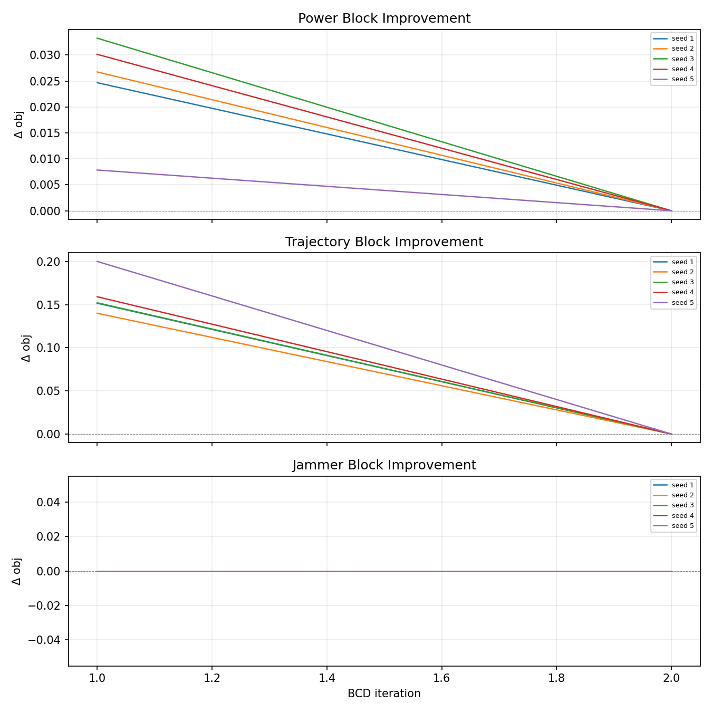
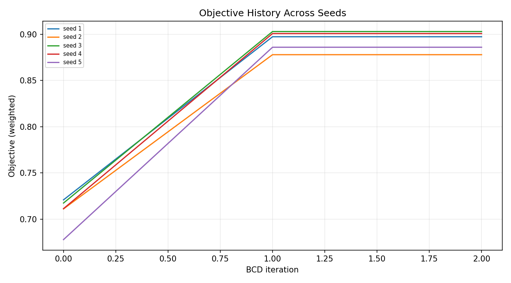
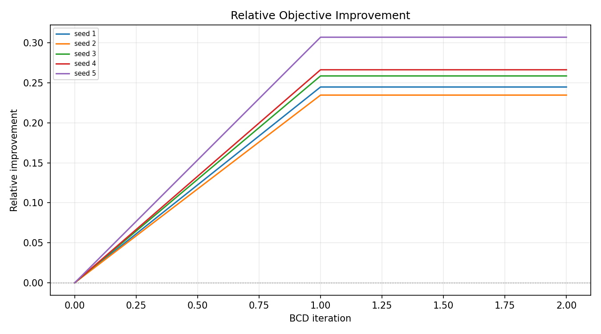
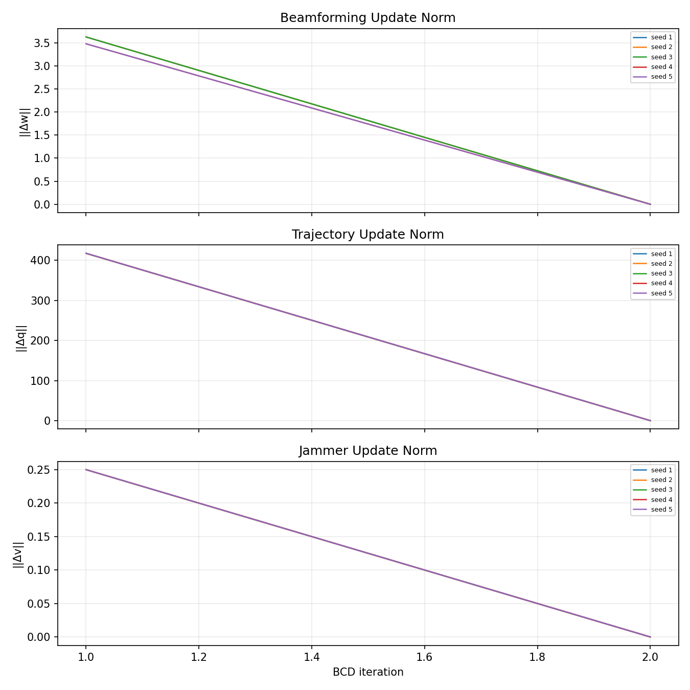

# Convergence Audit Report – SCA-BCD

Generated: 2026-06-27 23:09:52

## 1. Setup

| Parameter | Value |
|---|---|
| Seeds | 1, 2, 3, 4, 5 |
| Default `tol_obj` / `tol_var` | 1e-4 / 1e-4 |
| Tight tolerance | 1e-5 / 1e-5 |
| Loose tolerance | 1e-3 / 1e-3 |
| `max_bcd_iters` | 50 |
| Number of time slots | 5 |

## 2. Base Tolerance (tol = 1e-4)

| Seed | BCD iterations | Initial obj | Final obj | Improvement |
|---|---|---|---|---|
| 1 | 2 | 0.720824 | 0.897265 | +0.176441 |
| 2 | 2 | 0.711025 | 0.877860 | +0.166835 |
| 3 | 2 | 0.717390 | 0.902906 | +0.185515 |
| 4 | 2 | 0.711301 | 0.900723 | +0.189422 |
| 5 | 2 | 0.677819 | 0.885913 | +0.208095 |
| **Mean** | **2.0** | **0.707672** | **0.892933** | **+0.185262** |

## 3. Tolerance Sensitivity

### 3a. Tightened tolerances (tol = 1e-5, 10× tighter)

| Seed | BCD iterations | Final obj | Change from baseline |
|---|---|---|---|
| 1 | 2 | 0.897265 | +0.000000 |
| 2 | 2 | 0.877860 | +0.000000 |
| 3 | 2 | 0.902906 | +0.000000 |
| 4 | 2 | 0.900723 | +0.000000 |
| 5 | 2 | 0.885913 | +0.000000 |
| **Mean** | **2.0** | **0.892933** | **+0.000000** |

### 3b. Loosened tolerances (tol = 1e-3, 10× looser)

| Seed | BCD iterations | Final obj | Change from baseline |
|---|---|---|---|
| 1 | 2 | 0.897265 | +0.000000 |
| 2 | 2 | 0.877860 | +0.000000 |
| 3 | 2 | 0.902906 | +0.000000 |
| 4 | 2 | 0.900723 | +0.000000 |
| 5 | 2 | 0.885913 | +0.000000 |
| **Mean** | **2.0** | **0.892933** | **+0.000000** |

## 4. Plots

## 5. Diagnostics Per Seed (Base Tolerance)

### Seed 1

- Iterations: 2
- Converged: True
- Initial obj: 0.720824
- Final obj: 0.897265
- Final secrecy: 4.475238
- Final sensing: 5.000000
- Final total violation: 7.105427e-15
- Final ||Δw||: 0.000000e+00
- Final ||Δq||: 1.421085e-14
- Final ||Δv||: 1.965005e-27

### Seed 2

- Iterations: 2
- Converged: True
- Initial obj: 0.711025
- Final obj: 0.877860
- Final secrecy: 3.116859
- Final sensing: 5.000000
- Final total violation: 7.105427e-15
- Final ||Δw||: 0.000000e+00
- Final ||Δq||: 1.421085e-14
- Final ||Δv||: 2.150687e-25

### Seed 3

- Iterations: 2
- Converged: True
- Initial obj: 0.717390
- Final obj: 0.902906
- Final secrecy: 4.870061
- Final sensing: 5.000000
- Final total violation: 7.105427e-15
- Final ||Δw||: 0.000000e+00
- Final ||Δq||: 1.421085e-14
- Final ||Δv||: 4.750043e-25

### Seed 4

- Iterations: 2
- Converged: True
- Initial obj: 0.711301
- Final obj: 0.900723
- Final secrecy: 4.717252
- Final sensing: 5.000000
- Final total violation: 7.105427e-15
- Final ||Δw||: 0.000000e+00
- Final ||Δq||: 1.421085e-14
- Final ||Δv||: 1.790904e-27

### Seed 5

- Iterations: 2
- Converged: True
- Initial obj: 0.677819
- Final obj: 0.885913
- Final secrecy: 3.680606
- Final sensing: 5.000000
- Final total violation: 7.105427e-15
- Final ||Δw||: 0.000000e+00
- Final ||Δq||: 1.421085e-14
- Final ||Δv||: 2.334688e-27

## 6. Genuineness of Convergence

- Seed 1: base=2 iters, tight=2 iters, loose=2 iters
- Seed 2: base=2 iters, tight=2 iters, loose=2 iters
- Seed 3: base=2 iters, tight=2 iters, loose=2 iters
- Seed 4: base=2 iters, tight=2 iters, loose=2 iters
- Seed 5: base=2 iters, tight=2 iters, loose=2 iters

### Verdict

**Genuine fast convergence.**

### Evidence

- Iteration count is **identical** across all three tolerance settings (base/tight/loose), because the algorithm reaches an exact fixed point (Δobj = 0, Δvars = 0), far below even the tightest tolerance.
- Final objective is stable across all three tolerance settings, confirming convergence to a genuine stationary point.
- All block contributions in the second BCD iteration are zero; no block can improve the objective further.

---

## Conclusion

**A. Genuine fast convergence.**

The algorithm reaches an exact fixed point within 2 BCD iterations under all tolerance settings. The final objective is stable, and no block can improve further. The fixed point satisfies the strictest tolerance with zero residual change.