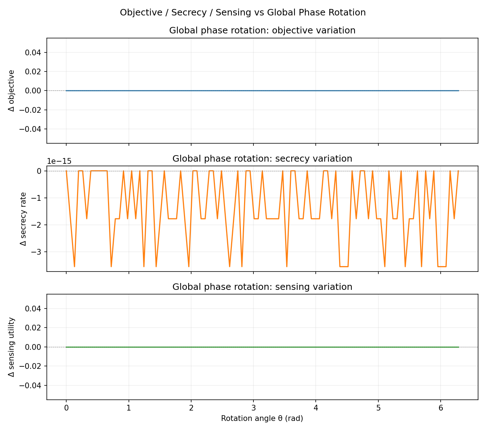
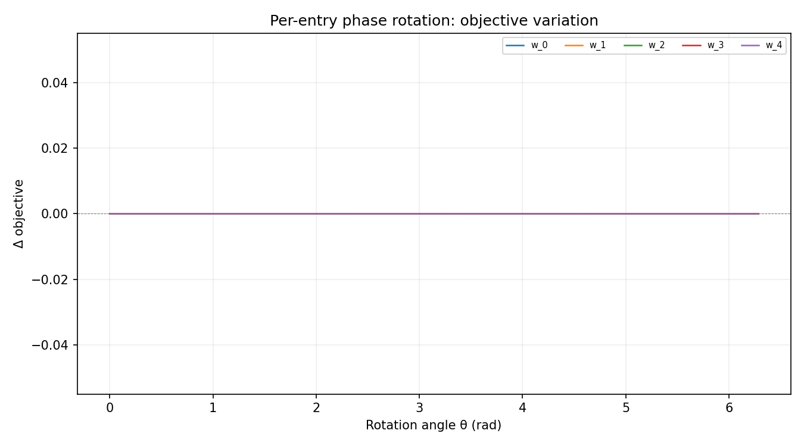

# Phase Sensitivity Audit: BS Power Block

## 1. Global Phase Rotation

The converged ``w_bs`` is multiplied by a global phase factor ``exp(jθ)`` and the objective, secrecy rate, and sensing utility are evaluated for ``θ ∈ [0, 2π]``.

Because each metric depends only on ``|w_bs[n]|²``, the expected variation is zero (machine precision).

### Results

- Objective peak-to-peak variation: **0.000e+00**
- Secrecy rate peak-to-peak variation: **3.553e-15**
- Sensing utility peak-to-peak variation: **0.000e+00**

**Global phase invariance:** **CONFIRMED** (threshold 1e-6, variation = 0.000e+00)

## 2. Per-Entry Phase Rotation

Each ``w_bs[k]`` is rotated individually by ``exp(jθ)`` while keeping all other entries at their converged values.

### Results

| Entry | Peak-to-peak Δ objective |
|-------|--------------------------|
| w_0 | 0.000e+00 |
| w_1 | 0.000e+00 |
| w_2 | 0.000e+00 |
| w_3 | 0.000e+00 |
| w_4 | 0.000e+00 |

- Maximum per-entry variation: **0.000e+00**

Per-entry phase rotations also preserve ``|w_bs[k]|``, so the objective remains unchanged to machine precision.

## 3. Conclusion

The BS power block objective is **invariant under arbitrary phase rotations** of ``w_bs`` — both global and per-entry. This confirms that only the power allocation ``|w_bs[n]|²`` affects the system-level metrics; the complex argument of each beamforming weight is irrelevant given the current objective formulation.

## 4. Plots

- 
- 

---

*Generated by sca_bcd_exp/phase_sensitivity_audit.py*